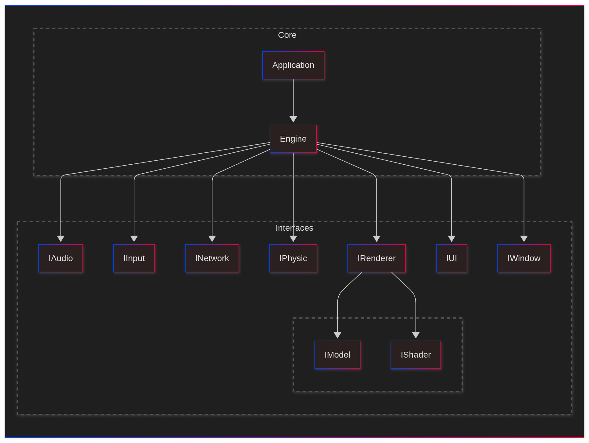

[](https://github.com/bobis33/Cross-API-Engine/actions/workflows/ci.yml)
[](https://github.com/bobis33/Cross-API-Engine/actions/workflows/gitleaks.yml)
[](https://github.com/bobis33/Cross-API-Engine/blob/main/LICENSE.md)

# Cross-API-Engine | Modular Rendering Engine

Cross-API-Engine is a fully modular and plugin-oriented engine architecture designed to decouple every subsystem — rendering, windowing, input, audio, and more — into independently loadable runtime modules.
Rather than focusing only on graphics API abstraction, the objective is to create an engine where every component can be swapped, extended, or replaced without modifying core code.
This enables rapid experimentation, platform portability, performance benchmarking, and true freedom in engine architecture research.


## Supported Platforms
| Platform | Compiler | Status |
|----------|----------|--------|
| Windows  | MSVC     | ✅      |
| Linux    | g++      | ✅      |
| MacOS    | g++      | ✅      |
| iOS      |          | ❌      |
| tvOS     |          | ❌      |
| Android  |          | ❌      |
| Web      |          | ❌      |

## Prerequisites

Make sure you have the following dependencies installed on your system:

- [CMake 4.0.0](https://cmake.org/)
- [C++23](https://en.cppreference.com/w/cpp/23)

## Usage

### Build

#### UNIX (Linux, MacOS)

```bash
./scripts/unix/build.sh release
```

#### Windows

```powershell
cmake -S . -G "Ninja" -B cmake-build-release -DCMAKE_BUILD_TYPE=Release
cmake --build cmake-build-release --config Release
```

### Run

```bash
./cmake-build-release/bin/cae -h          
Usage: cae [options]

Options:
  -h, --help              Show this help message
  -v, --version           Show version information
  -c, --config <path>     Specify JSON configuration file
```

## External Libraries

- [Google Test](https://github.com/google/googletest): A testing framework for C++.
- [Doxygen Awesome CSS](https://github.com/jothepro/doxygen-awesome-css): A custom CSS theme for Doxygen documentation.
- [nlohmann-json](https://github.com/nlohmann/json): A JSON library for C++.

## Contributing

Want to contribute? See [contributing guidelines](https://github.com/bobis33/Cross-API-Engine/blob/main/CONTRIBUTING.md).

## License

This project is licensed under the MIT License - see the [license](https://github.com/bobis33/Cross-API-Engine/blob/main/LICENSE.md) for details.
