# Cross-API-Engine | Rendering Engine with multiple dynamic backends

Cross-API-Engine is a rendering engine designed to support multiple graphics APIs dynamically.
It allows developers to switch between different rendering backends such as OpenGL, Vulkan, DirectX at runtime.
It is useful to do benchmarks during development or to support multiple platforms with different graphics APIs.

```mermaid
flowchart LR
    subgraph CORE["🧠 Engine Core"]
        Engine["Engine"]
    end

    subgraph Interfaces["⚙️ Interfaces"]
        Engine --> IAudio["IAudio"]
        Engine --> INetwork["INetwork"]
        Engine --> IRenderer["IRenderer"]
        Engine --> IWindow["IWindow"]
        Engine --> IInput["IInput"]
    end

    subgraph AUDIO["🔊 Audio Plugins"]
        WASAPI["WASAPI / XAudio2 (Windows)"]
        Pulse["Pulse / ALSA (Linux)"]
        CoreAudio["CoreAudio (macOS)"]
    end
    IAudio --> WASAPI & Pulse & CoreAudio

    subgraph NETWORK["🌐 Network Plugins"]
        WinSock["WinSock (Windows)"]
        POSIX["POSIX Sockets (Linux/macOS)"]
    end
    INetwork --> WinSock & POSIX

    subgraph RENDERER["🎨 Renderer Plugins"]
        DirectX["DirectX (Windows)"]
        Vulkan["Vulkan (Cross-platform)"]
        OpenGL["OpenGL (Cross-platform)"]
        Metal["Metal (macOS)"]
    end
    IRenderer --> DirectX & Vulkan & OpenGL & Metal

    subgraph WINDOW["🪟 Window System Plugins"]
        Win32["Win32 (Windows)"]
        X11["X11 / Wayland (Linux)"]
        Cocoa["Cocoa (macOS)"]
    end
    IWindow --> Win32 & X11 & Cocoa

    subgraph INPUT["🎮 Input Plugins"]
        Keyboard["Keyboard"]
        Mouse["Mouse"]
        Controller["Gamepad / Controller"]
    end
    IInput --> Keyboard & Mouse & Controller
```

## Prerequisites

Make sure you have the following dependencies installed on your system:

- [CMake 4.0.0](https://cmake.org/)
- [C++23](https://en.cppreference.com/w/cpp/23)
- [Vulkan SDK](https://www.vulkan.org/)

## External Libraries

- [**GLFW**](https://github.com/glfw/glfw): For creating windows, receiving input, and managing OpenGL and Vulkan contexts.
- [**Google Test**](https://github.com/google/googletest): A testing framework for C++.
- [**ImGui**](https://github.com/ocornut/imgui): Immediate Mode Graphical User Interface for real-time debugging and tool development.
- [**stb**](https://github.com/nothings/stb): A set of single-file public domain libraries for graphics, image loading, and more.

## Contributing

Want to contribute? See [CONTRIBUTING.md](CONTRIBUTING.md).

## License

This project is licensed under the MIT License - see the [LICENSE](https://github.com/bobis33/Cross-API-Engine/blob/main/LICENSE.md) file for details.
