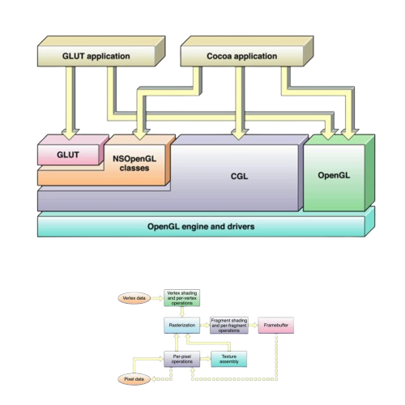

# Renderer | OpenGL plugin

> [!WARNING]
> OpenGL was deprecated in macOS 10.14.

```
if (Wayland) use EGL;
else if (supports EGL + GL) use EGL;
else fallback to GLX;
```

## Global arch

## EGL

## NSGL
